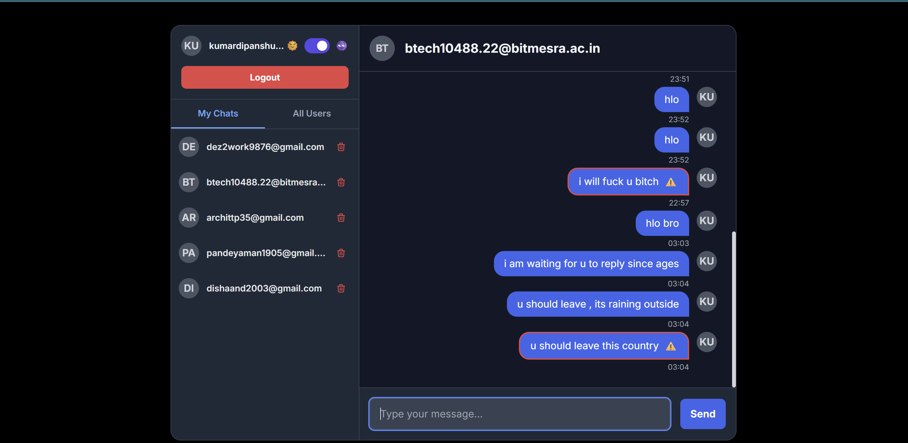

# 🛡️ SafeGuard AI — Real-Time Moderated Chat


**SafeGuard AI** is a **full-stack, real-time, peer-to-peer chat application** with an **integrated AI moderator** powered by a **fine-tuned BERT model** to detect and flag toxic or bullying messages instantly.  
It demonstrates a **modern, serverless architecture** combining **Firebase** for real-time messaging and **Hugging Face Spaces** for AI inference.  
If you find this project useful or interesting, please consider giving it a ⭐ **star**!

---

## 🚀 Live Demo  
🔗 **[Try the Application](https://safeguard-chat-app.vercel.app/)**  

---

## ✨ Key Features  

- **💬 Real-Time P2P Chat** — Instant messaging powered by **Google Firestore**.  
- **🤖 AI-Powered Moderation** — Each message is analyzed by a **fine-tuned BERT model** to detect toxicity, with ⚠️ warnings for harmful content.  
- **📱 Responsive UI** — Clean, modern design with **Tailwind CSS** that works seamlessly on all devices.  
- **🌓 Dark & Light Modes** — Theme switcher with saved preferences in the browser.  
- **🔐 User Authentication** — Secure sign-up/login with **Firebase Auth**.  
- **🗑️ Chat Management** — View all conversations and delete histories at any time.  

---

## 🛠 Tech Stack & Architecture  

**Frontend**  
- HTML5  
- Tailwind CSS  
- Vanilla JavaScript (ES6 Modules)  
- **Deployment:** Vercel  

**Backend (Serverless)**  
- **Database & Auth:** Google Firestore  
- **Real-Time Sync:** Firebase Realtime Updates  

**AI Model & API**  
- **Model:** Fine-tuned `bert-base-uncased` using **PyTorch** + Hugging Face Transformers  
- **API Framework:** FastAPI  
- **Deployment:** Hugging Face Spaces  
- **Model Repo:** [bullying-detector](https://github.com/Dipanshu7777/bullying-detector)  
- **Live API:** [SafeGuard API](https://huggingface.co/spaces/dez2work9876/safeguard-api)  

---

## 📊 Model Performance  

| Metric                  | Score |
|-------------------------|-------|
| **Overall Accuracy**    | 93%   |
| **Recall (Bullying)**   | 96%   |
| **Precision (Bullying)**| 90%   |

**Dataset:** Balanced dataset of **115,000+ samples**.  
**Training:** Optimized for real-time classification in chat environments.  

---

## ⚙️ Getting Started  

### **Prerequisites**
- A modern web browser  
- Firebase project with Authentication + Firestore enabled  
- Deployed model API on Hugging Face Spaces  

---

### **Local Setup**  

1️⃣ **Clone the repository**  
```bash
git clone https://github.com/Dipanshu7777/safeguard-chat-app.git
cd safeguard-chat-app
``` 

2️⃣ Configure Firebase

Go to Firebase Console
Create a new project
Enable Authentication (Email/Google)
Enable Cloud Firestore
Get your Firebase config and add it to config.js:

// config.js
```bash
const firebaseConfig = {
  apiKey: "YOUR_API_KEY",
  authDomain: "YOUR_PROJECT.firebaseapp.com",
  projectId: "YOUR_PROJECT_ID",
  storageBucket: "YOUR_PROJECT.appspot.com",
  messagingSenderId: "YOUR_MESSAGING_ID",
  appId: "YOUR_APP_ID"
};
```

export default firebaseConfig;

3️⃣ Install dependencies
```bash
npm install
```

4️⃣ Run the app locally

```bash
npm start
```
## 🌐 Deployment

### Frontend
Deploy to **Vercel**:  
1. Connect your GitHub repository  
2. Configure Firebase environment variables  
3. Deploy 🎉  

### Model API
Already deployed on **Hugging Face Spaces**.  
If redeploying, push updates to your `bullying-detector` repo and redeploy the space.

---

## 🔒 Security Notes
- **Do not** expose any private Hugging Face API tokens in client-side code.  
- Always call private spaces through a **secure backend proxy**.  
- Implement **rate-limiting** and **validation** on your proxy endpoints.

---

## 🤝 Contributing
Contributions, issues, and feature requests are welcome!  
Feel free to **fork the repo** and submit a **pull request**.

---

## 📬 Contact
For questions, feedback, or collaboration opportunities, feel free to reach out:
 
- **Email:**   kumardipanshu7777[at]gmail[.]com

## 📜 License
This project is licensed under the **MIT License**.

---

## ⭐ Support
If you found this project useful or inspiring, please give it a **star** on GitHub!


